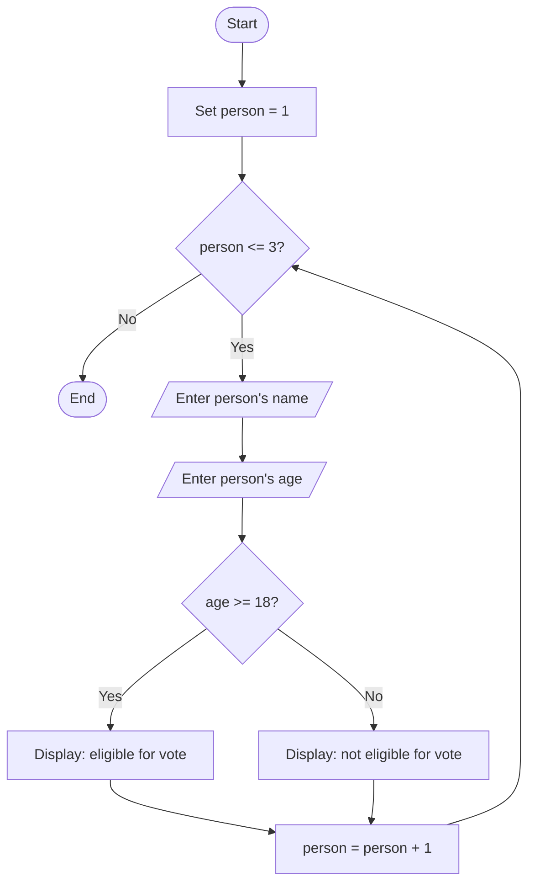

# Using for Loop Flowchart

```mermaid
flowchart TD
    A([Start]) --> B[Set person = 1]
    B --> C{person <= 3?}
    C -- No --> J([End])
    C -- Yes --> D[/Enter person's name/]
    D --> E[/Enter person's age/]
    E --> F{age >= 18?}
    F -- Yes --> G[Display: eligible for vote]
    F -- No --> H[Display: not eligible for vote]
    G --> I[person = person + 1]
    H --> I
    I --> C
```
