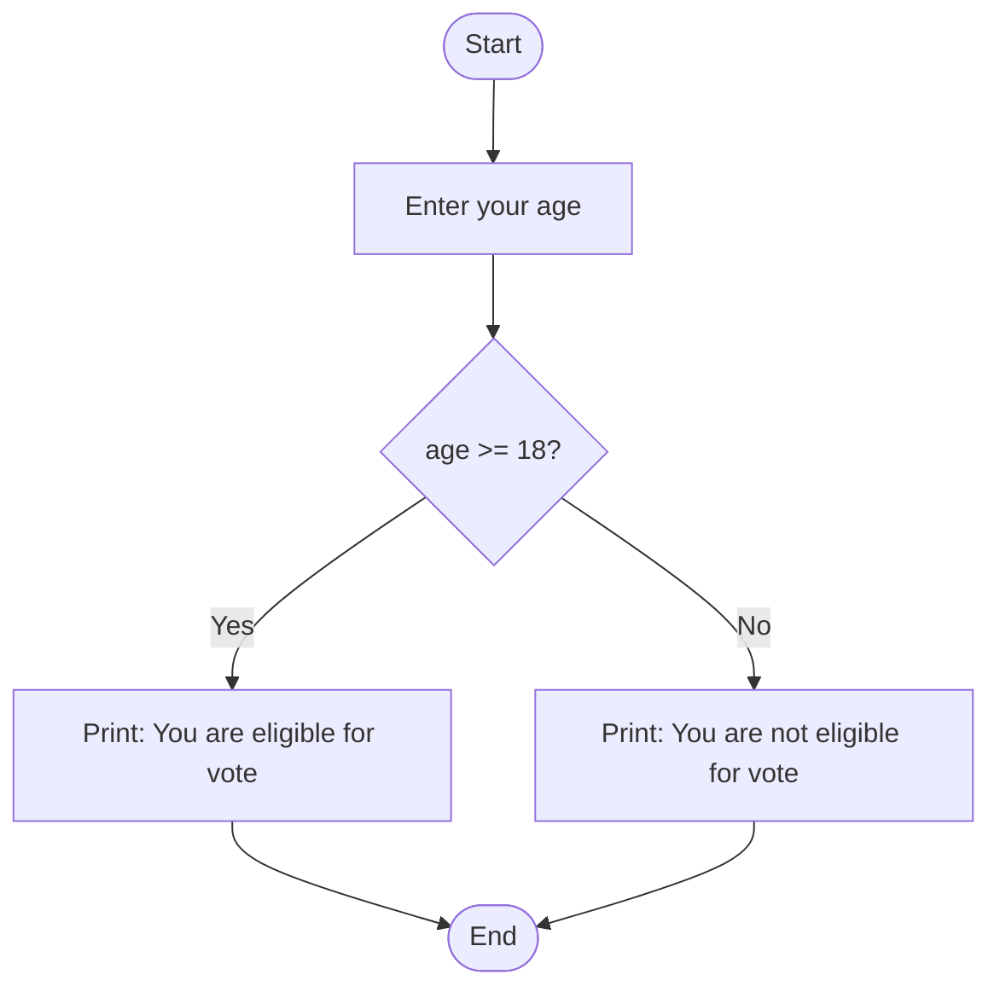

# Using simple-IF — Code + Flowchar

```mermaid
flowchart TD
  Start([Start]) --> Input[Enter your age]
  Input --> Decision{age >= 18?}
  Decision -->|Yes| Eligible[Print: You are eligible for vote]
  Decision -->|No| NotEligible[Print: You are not eligible for vote]
  Eligible --> End([End])
  NotEligible --> End
```

