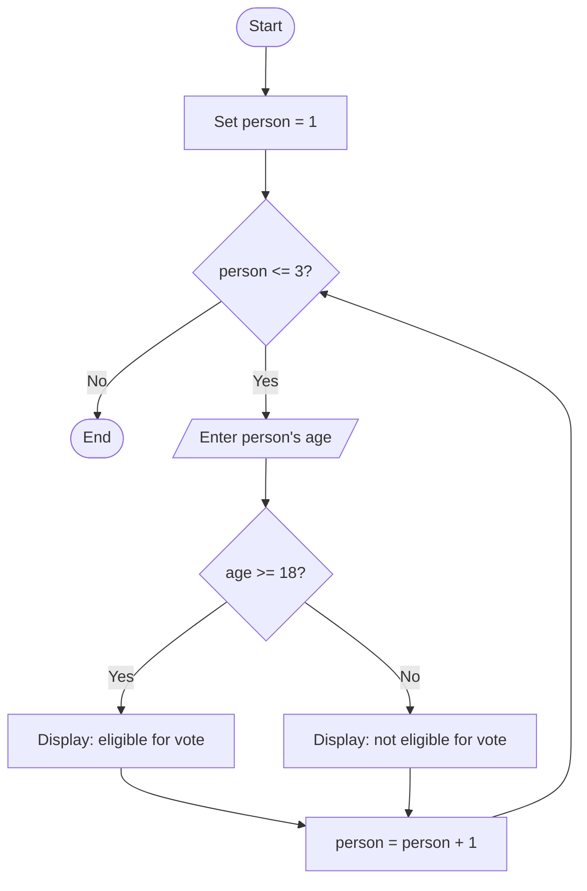

# Using while loop Flowchart

```mermaid
flowchart TD
    A([Start]) --> B[Set person = 1]
    B --> C{person <= 3?}
    C -- No --> I([End])
    C -- Yes --> D[/Enter person's age/]
    D --> E{age >= 18?}
    E -- Yes --> F[Display: eligible for vote]
    E -- No --> G[Display: not eligible for vote]
    F --> H[person = person + 1]
    G --> H
    H --> C
```
