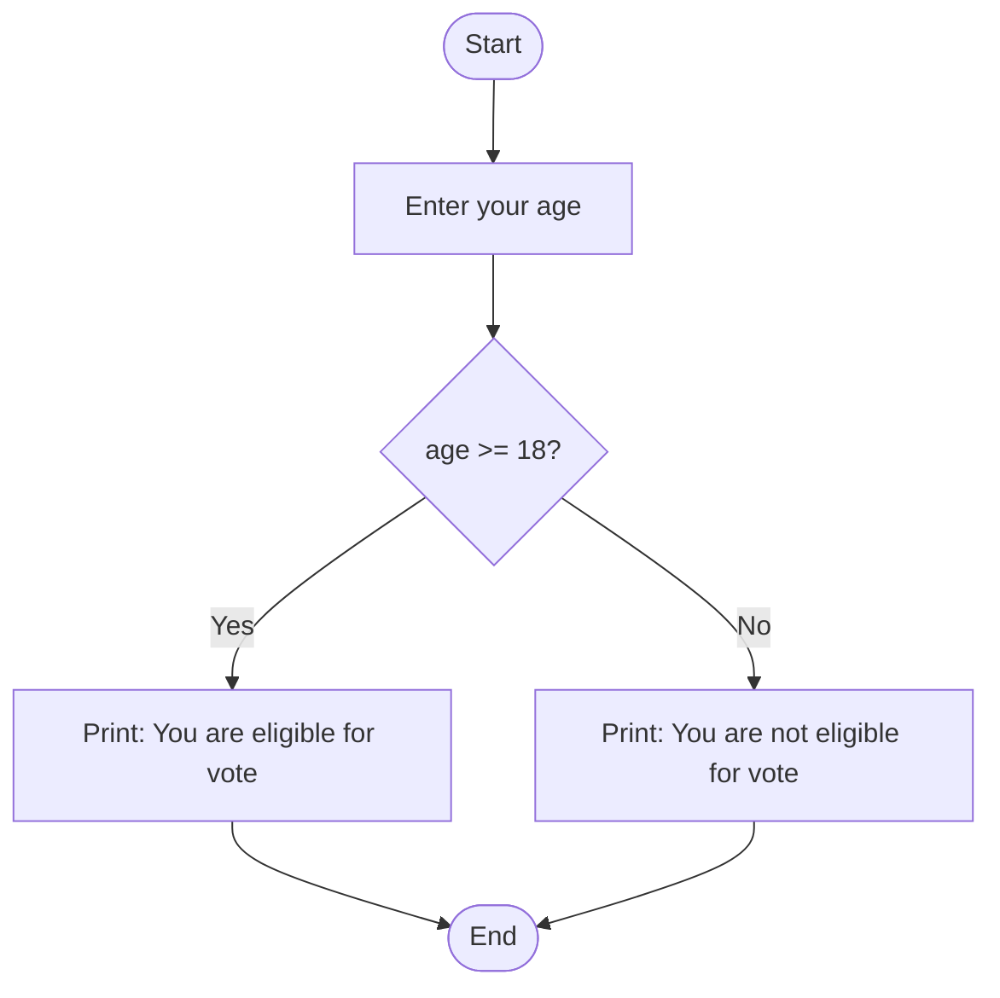

# Using simple-IF — Code + Flowchart

Below is your C program followed by a simple flowchart (Mermaid) that represents the program logic.

```c
#include <stdio.h>

int main()
{
    int age;
    printf("Enter your age:");
    scanf("%d",&age);
    if(age>=18)
    {
        printf("You are eligible for vote");
    }
    else
    {
        printf("Your are not eligible for vote");
    }
    return 0;
}
```



How to view:
- Open this file in VS Code and press `Ctrl+Shift+V` to open the Markdown preview.
- Or open `flowchart-vote.html` in a browser to view the diagram without extensions.
